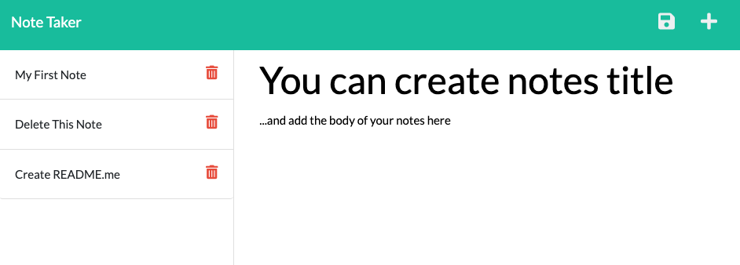

# Node.js Note Taker
  

## Description:
This Note Taker applicaiton can be used to write and save notes. This application uses an Express.js back end and Node Routing with API endpoints to save and retrieve note data from a JSON file.

## Deployed App:
 [App deployed to Heroku:](https://vast-plains-36846.herokuapp.com/)

## UI/UX Screenshot:

## Table of Contents:
- [Node.js Note Taker](#nodejs-note-taker)
  - [Description:](#description)
  - [UI/UX Screenshot:](#uiux-screenshot)
  - [Table of Contents:](#table-of-contents)
  - [Installation](#installation)
  - [Usage](#usage)
  - [Credits](#credits)
  - [Questions](#questions)
  - [Contributing](#contributing)
  - [Tests](#tests)
  - [License](#license)

## Installation
_________________
To install this application, you'll need to 
- Node.js
- uuidv4 npm package: `npm i uuidv4`

## Usage
_________________

Run the following script from your terminal `npm run start`

## Credits
_________________
* README badges pulled from [https://naereen.github.io/badges/](https://naereen.github.io/badges/)

## Questions
  _________________
  Contact me with any questions, comments or suggestions at:
* [GitHub.com/jfulbright](http://github.com/jfulbright)
* [jfulbright@gmail.com](mailto:jfulbright@gmail.com)
* [LinkedIn.com/in/Jeremyfulbright](https://www.linkedin.com/in/Jeremyfulbright)

## Contributing
_________________
Pull requests are welcome. For major changes, please open an issue first to discuss what you would like to change. Please make sure to update tests as appropriate.

## Tests
_________________
run `npm i jest` and `npm run test`

## License
_________________

* This project is licensed under the terms of the MIT license.
* [https://lbesson.mit-license.org/](https://lbesson.mit-license.org/)
* Legal Code: [LICENSE](LICENSE)

